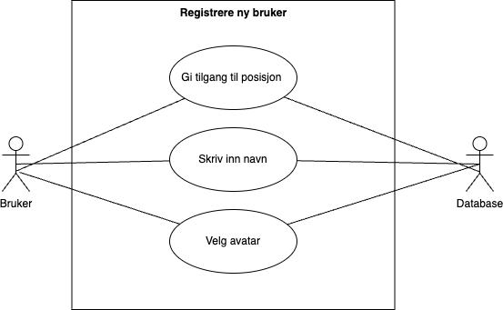
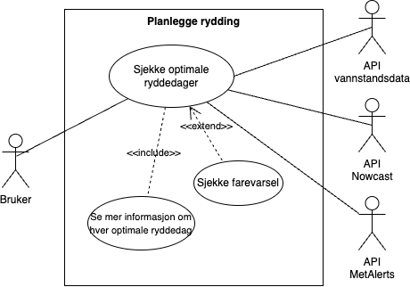
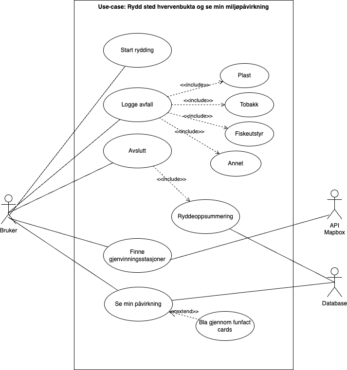
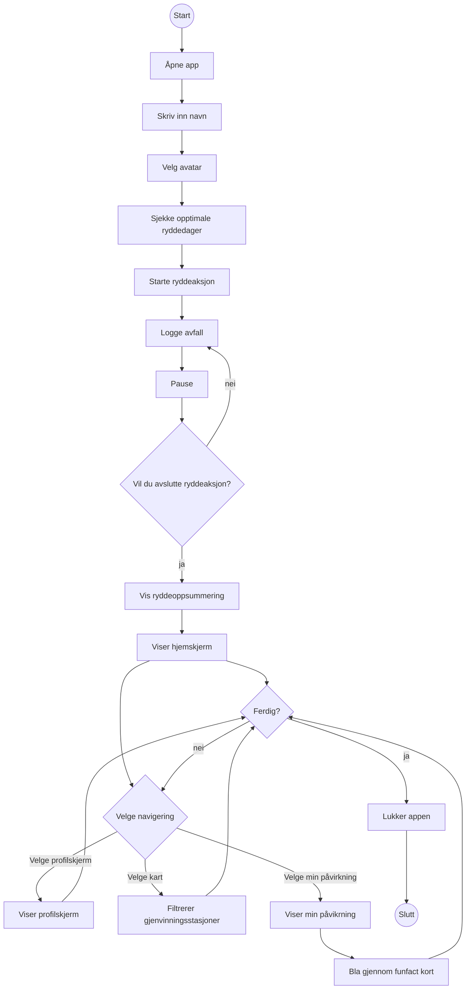
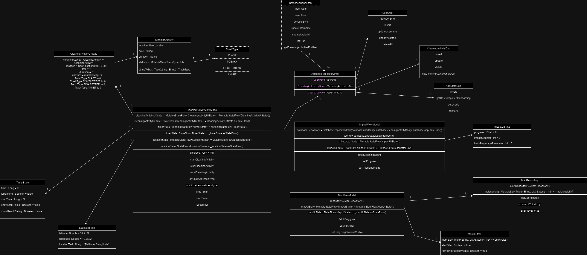
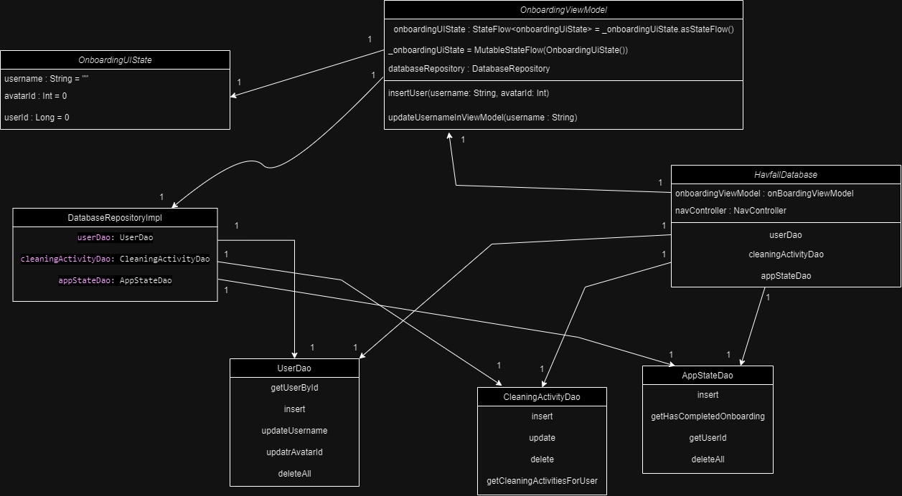
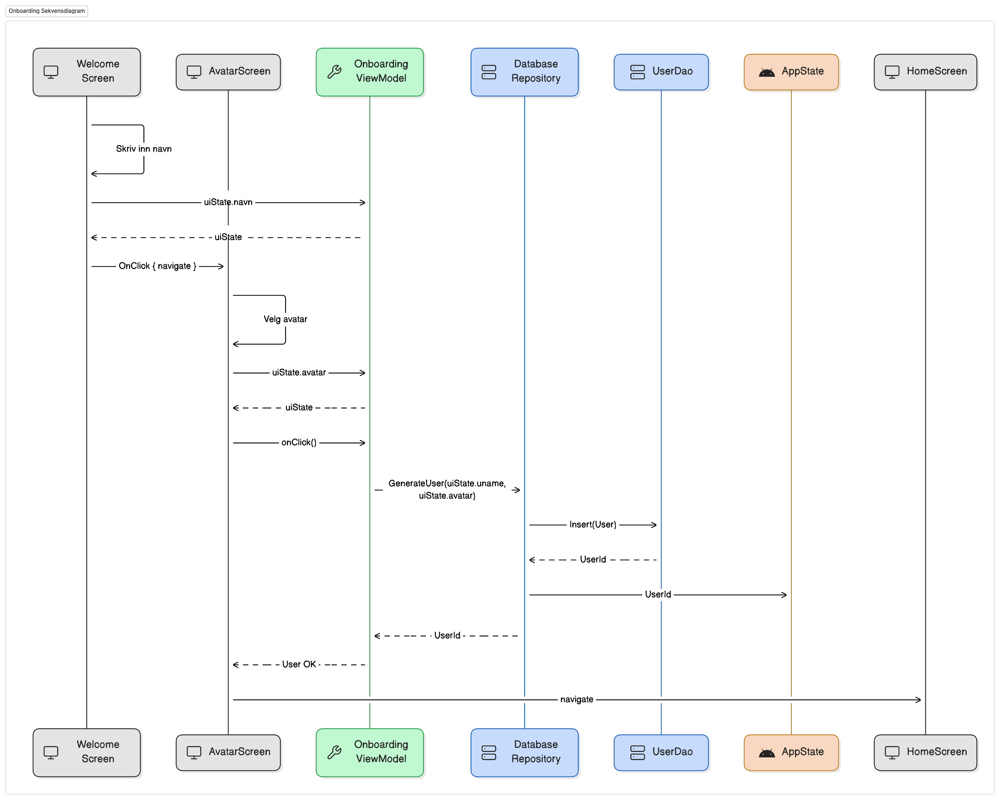
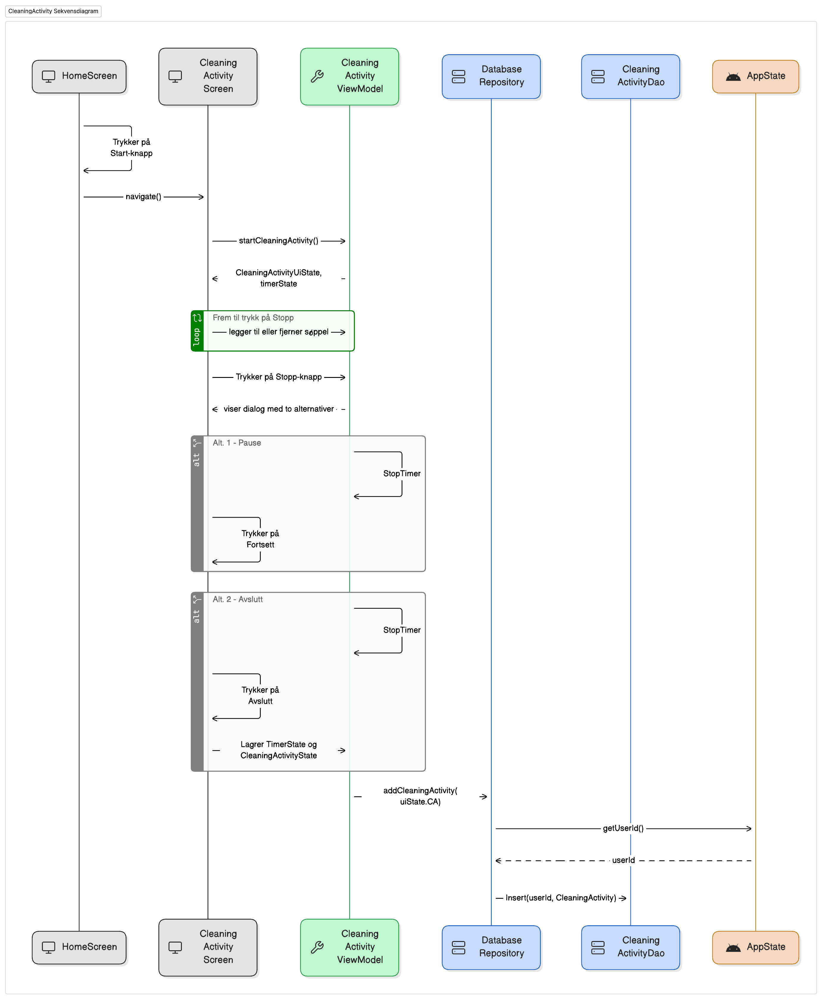

## Use case: Registrere ny bruker
  
**Tekstlig beskrivelse:**   
**Primæraktør:** Bruker   
**Sekundæraktør:** Database  
**Pre-betingelser:** Bruker har tilgang til internett   
**Post-betingelser:** Databasen lagrer navn, avatar og får tilgang til lokasjon  
**Hovedflyt:**   
1. Systemet spør om bruker ønsker å oppgi posisjon  
2. Bruker gir tilgang til posisjon  
3. Bruker åpner applikasjonen Havfall   
4. Systemet ber bruker skrive inn navnet sitt  
5. Bruker skriver inn navn og trykker neste   
6. Systemet ber bruker velge en avatar   
7. Bruker velger avatar og trykker kom i gang  
8. Systemet viser hjemskjermen   

## Use case: planlegge ryddeaksjon
  
**Tekstlig beskrivelse:**   
**Primær Aktør:** Bruker
**Sekundær Aktør:** API vannstandsdata, API Nowcast, API MetAlerts  
**Pre-betingelser:** Bruker har tilgang til internett og befinner seg på HomeScreen   
**Post-betingelser:** Optimale ryddedager for angitt lokasjon vises  
**Hovedflyt:**  
1. Systemet viser opptil 4 optimale ryddedager  
2. Bruker trykker på en valgt dato  
3. Systemet presenterer et vindu med mer detaljert værinformasjon for den valgte dagen  
4. Bruker avslutter applikasjonen  
**Alternativ flyt:**  
1.1 Systemet viser farevarsel-ikonet på hjemskjerm  
1.2 Bruker trykker på ikonet og ser farevarselet for i dag  
1.3 Returner til hovedflyt, steg 4  

## Use case: Ryddeaksjon på Hvervenbukta med min påvirkning
  
**Tekstlig beskrivelse:**   
**Primæraktør:** Bruker   
**Sekundæraktør:** API MapBox, Database  
**Pre-betingelser:** Bruker har allerede laget bruker i appen og er koblet til internett  
**Post-betingelser:** Ryddeaksjonen lagres i profilskjerm, søppelsekken på impactScreen utvider seg og hittil i år øker  
**Hovedflyt:**  
1. Bruker åpner applikasjonen  
2. Systemet viser hjemskjerm   
3. Bruker trykker på start rydding knappen  
4. Systemet viser ryddelogg   
5. Bruker logger avfallet de plukker   
6. Bruker trykker stopp  
7. Systemet spør bruker om de vil fortsette eller avslutte   
8. Bruker avslutter   
9. System viser ryddeoppsummering til bruker   
10. Systemet oppdaterer søppelsekkken og barometeret i ImpactScreen, samt legger til ryddeaksjonen i ProfileScreen  
11. Bruker navigerer seg til MapScreen  
12. Systemet viser kartet og gjenvinningsstasjoner i området  
13. Bruker zoomer inn og finner den gjenvinningsstasjonen som er nærmest dem  
14. Bruker navigerer seg til ImpactScreen   
15. Systemet viser ImpactScreen  
16. Bruker blar gjennom funfact-kortene   
**Alternativ flyt:**   
8.1 Bruker trykker fortsett   
8.3 Returner til hovedflyt, steg 4. 

## Aktivitetsdiagram 
Aktivitetsdiagram av hovedfunsjonaliteten til appen

## Klassediagrammer over de to viktigste use-casene

## Klassediagram - Ryddeaksjon 
Diagrammet viser en oversikt over alle klasser som er tilknyttet use-caset "Ryddeaksjon på Hvervenbukta med min påvirkning"

## Klassediagram - Registrere ny bruker
Diagrammet viser en oversikt over alle klasser som er tilknyttet use-caset "Registrere ny bruker"

## Sekvensdiagram - Onboarding

## Sekvensdiagram - Ryddeaksjon

